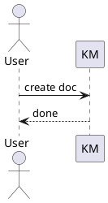
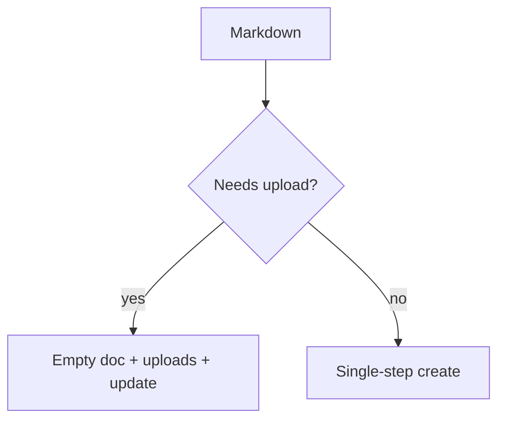

# KM Markdown Surface (km create --file)

`km create --file` accepts Markdown-first input and produces a KM 2.0 collaboration doc (`/collabpage/<docId>`). This file is the authoritative list of supported syntax.

## Block structure

- ATX headings: `# H1` … `###### H6`
- Setext headings: `Title\n===` (H1), `Title\n---` (H2)
- Paragraphs split by blank lines
- Hard break: line ending with `\` or two trailing spaces
- Legacy indented paragraphs: 4 leading spaces → `indent=1`, 12 spaces → `indent=2`, etc.
- Horizontal rule: `---`, `***`, `___`
- Blockquote: `> text` (single-paragraph quotes; nested blocks not supported)
- Lists: `- a` / `1. a` / `- [ ] todo` / `- [x] done`, nested via 2-space indent
- Fenced code: ` ```lang ` or `~~~lang` (any fence length ≥ 3)
- Tables: pipe tables with optional `:--- / :--: / ---:` alignment, escaped `\|`, inline code `` `x | y` ``
- Footnotes: `text[^a]` plus a `[^a]: annotation` definition block
- Collapse: `<details>` / `<details open>` containing `<summary>title</summary>` and body

## Inline marks

| Markdown | Resulting mark |
|---|---|
| `**bold**` / `__bold__` | `strong` |
| `*italic*` / `_italic_` | `em` |
| `~~strike~~` | `strikethrough` |
| `` `code` `` | `code` |
| `==highlight==` | `backgroundcolor` (yellow) |
| `^superscript^` | `sup` |
| `~subscript~` | `sub` |
| `<u>under</u>` | `underline` |
| `<sup>2</sup>` / `<sub>n</sub>` | `sup` / `sub` |

Other HTML tags stay as escaped text. Inline math `$E=mc^2$` becomes a `latex_inline` node.

## Links and mentions

- Inline link: `[text](https://… "optional title")`
- Reference link: `[text][ref]` plus `[ref]: https://… "title"`
- Autolink: `<https://…>` or `<email@host>`
- Bare URL / email in prose
- Mention: bare `@<mis>` in prose — resolved via `/api/users?mis=…&tenantId=1`. Skipped inside fenced code, inline code, link text/URL, autolinks, and email addresses; `\@mis` stays literal. Unresolved mentions remain as text and the CLI prints `提示: 以下 @mis 未解析…`.

## Diagram code blocks

| Fence language | Behaviour |
|---|---|
| ` ```plantuml ` / ` ```puml ` | Native `plantuml` node. Size detected by hitting the KM PlantUML SVG server. |
| ` ```mermaid ` | Two-stage flow: create mermaid attachment via `/api/open/attachment/create` + mermaid upload; emit `open_iframe` node. |
| ` ```minder ` / ` ```mindmap ` | Render outline / JSON to a Minder-editable SVG and upload as a `minder` node. |
| ` ```km-html ` | Native Parker `html` macro node. Supports inline fragments or `file="./fragment.html"` references. |





```minder
Project Plan
  Requirements
    Discovery
  Engineering
    Backend
    Frontend
```

## HTML macro

Use `km-html` fenced blocks when the created doc needs an editor-native HTML macro without opening the browser:

````markdown
```km-html source="km-dashboard"
<style>
.km-dashboard { width: 100%; }
</style>
<div class="km-dashboard" data-km-dashboard="1">...</div>
<script>
(() => {
  document.querySelectorAll(".km-dashboard:not([data-bound])").forEach((root) => {
    root.dataset.bound = "1";
  });
})();
</script>
```
````

For larger fragments, reference a local HTML file relative to the markdown file:

````markdown
```km-html source="km-dashboard" file="./dashboard.html"
```
````

Constraints follow `kmedit insert_html`:

- The content must be an HTML fragment, not a full page; do not include `<!doctype>`, `<html>`, `<head>`, or `<body>`.
- Use one top-level root element with a unique class or `data-*` marker. Optional `<style>` and `<script>` must be top-level siblings.
- Do not use local paths, localhost, external JS/CDN, `<script src>`, inline event handlers, `eval`, dynamic script injection, storage/cookie access, `postMessage`, or remote API calls.
- Local images/assets inside the HTML fragment are not uploaded in this mode. Use KM-hosted URLs or insert assets as normal Markdown/KM nodes outside the macro.

## LaTeX

```
Inline: $x = \frac{-b \pm \sqrt{b^2-4ac}}{2a}$

$$
\int_{-\infty}^{\infty} e^{-x^2}\,dx = \sqrt{\pi}
$$
```

## Local resources

Path styles accepted everywhere a local file is referenced: relative, absolute, `~/…`, `file://…`. Paths are resolved relative to the directory of the `--file` argument.

| Use case | Markdown | Extensions | KM node |
|---|---|---|---|
| Image | `` | `.png .jpg .jpeg .gif .webp .bmp` | `image` |
| Plain SVG | `` | `.svg` (no minder/drawio content) | `image` |
| DrawIO | `` or `` | `.drawio`, `.drawio.svg`, `.svg` with `mxfile` content | `drawio` (editable) |
| Minder mind map | `` or fenced ` ```minder ` | `.minder.svg`, `.svg` with mind-map content | `minder` |
| Attachment | `[label](./spec.pdf "title")` standalone on a line | `.pdf .doc .docx .xls .xlsx .ppt .pptx .zip` | `attachment` |
| Audio | `[label](./voice.mp3 "title")` standalone | `.mp3 .wav .m4a .aac .flac .ogg .oga` | `audio` |
| Video | `[label](./demo.mp4 "title")` standalone | `.mp4 .mov .m4v .webm .ogv` | `video` |

> Attachment / audio / video links must be the **only** content on their line (standalone) to upload. Inline use becomes a regular link.

> If `` is missing on disk but `./foo.drawio` exists with the same stem, the converter automatically uses the `.drawio` file (legacy fallback).

## Two-stage create (automatic)

The CLI inspects the markdown before sending:

1. **Resource-bearing doc** — any local image / drawIO / minder / attachment / audio / video / fenced mermaid / fenced minder. Flow: create empty 2.0 doc → upload assets to that `docId` → `POST /api/pages/updateCollaborationContent/<docId>` with the final JSON.
2. **Pure-text doc** — no uploadable resources. Single shot: `POST /api/pages/addCollaborationContent`.

If the upload phase fails, the empty placeholder remains under the parent — `km delete <docId>` to clean up.

## Constraints

For precise edits to an existing document, updates to an existing HTML macro, or insertion at a runtime-selected node position, use the `kmedit` skill after creation.
